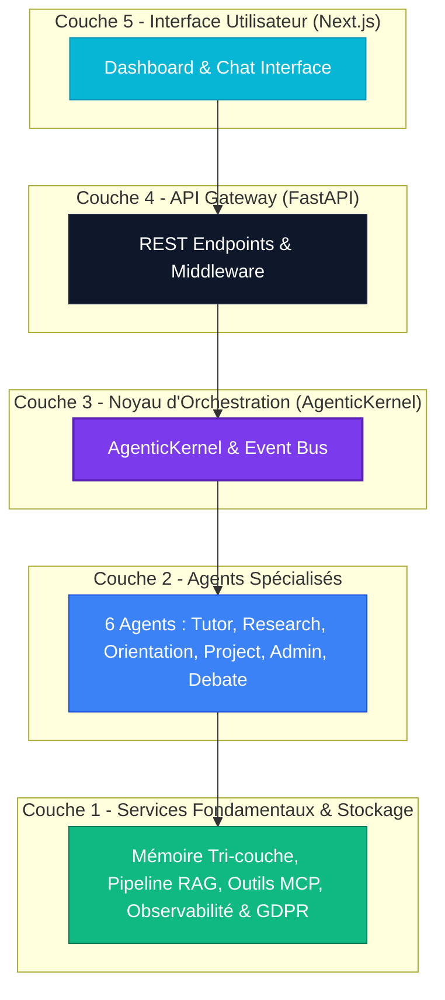

# ENSAM-Agent-OS

ENSAM-Agent-OS est un système d'exploitation agentique local et gouverné, conçu spécifiquement pour le contexte académique de l'ENSAM Meknès (École Nationale Supérieure d'Arts et Métiers). 

Cette plateforme intègre une architecture multi-agents spécialisés, un système de mémoire tri-couche persistante, un pipeline RAG (Génération Augmentée par Récupération), un registre d'outils standardisé via le protocole MCP (Model Context Protocol) et un mécanisme de débat inter-agents. Le système met l'accent sur la gouvernance, l'observabilité, le contrôle des coûts et le respect de la confidentialité des données (conformité RGPD / GDPR).

---

## Architecture du Système

ENSAM-Agent-OS repose sur une architecture en couches orchestrée par un noyau central : l'AgenticKernel.



### 1. Les 6 Agents Spécialisés
*   Tutor Agent : Accompagnement pédagogique personnalisé, explications de cours et création de quiz.
*   Research Agent : Synthèse de publications, veille technologique et rédaction scientifique.
*   Orientation Agent : Conseil sur le parcours académique, les stages et les débouchés professionnels.
*   Project Agent : Gestion des projets étudiants, suivi de jalons et répartition des tâches.
*   Admin Agent : Réponse aux questions administratives de l'ENSAM (inscriptions, examens, etc.).
*   Debate Agent : Orchestration de débats contradictoires multi-rounds entre points de vue alternatifs pour approfondir un sujet.

### 2. Le Système Mémoire Tri-couche
*   Mémoire Éphémère (Court terme) : Gestion des conversations en cours avec un mécanisme de Time-to-Live (TTL).
*   Mémoire Sémantique (Long terme) : Stockage d'embeddings vectoriels dans ChromaDB pour la récupération sémantique de faits passés.
*   Graphe de Connaissances : Modélisation des relations complexes entre entités (étudiants, cours, projets) à l'aide de NetworkX.

### 3. Gouvernance et Sécurité
*   Routage Sensible au PII (Données Personnelles) : Analyse des requêtes et anonymisation des informations sensibles avant tout appel à des API externes.
*   Routage Hybride Local/Cloud : Routage automatique des requêtes complexes vers des modèles distants performants (via Groq) et traitement des requêtes simples ou sensibles en local (via Ollama) pour optimiser les coûts et la sécurité.
*   Droit à l'Oubli (GDPR) : Fonctionnalité d'effacement complet des données personnelles et historiques sur simple demande.

---

## Structure du Dépôt

Le projet est divisé en trois dossiers principaux :

*   `backend/` : Code source Python de l'API REST et de l'AgenticKernel.
    *   `app/core/` : Composants noyau (Kernel, Event Bus, LLM, Web Search).
    *   `app/agents/` : Définitions et logique des agents spécialisés.
    *   `app/memory/` : Gestion de la mémoire et conformité RGPD.
    *   `app/rag/` : Pipeline d'ingestion et de recherche de documents.
    *   `app/mcp/` : Registre des outils externes compatibles avec le Model Context Protocol.
    *   `app/observability/` : Audit, traçabilité et monitoring de coûts.
*   `frontend/` : Interface utilisateur en Next.js (React) et Tailwind CSS.
    *   `src/app/` : Pages du dashboard (Chat, Analytics, Knowledge, Privacy, Settings).
    *   `src/components/` : Composants réutilisables (graphiques de coûts, logs d'audit, chat interactif).
*   `article/` : Code source LaTeX et PDF du rapport de recherche appliquée (~40 pages).
    *   `Rapport_Projet_Métier.tex` : Document LaTeX complet détaillant la méthodologie, l'architecture et les résultats.
    *   `Rapport_Projet_Métier.pdf` : Version compilée prête à la lecture.

---

## Démarrage Rapide

### Prérequis
*   Windows 10/11 ou Linux.
*   Python 3.10+ (installé de préférence avec le gestionnaire de paquets uv).
*   Node.js v18+ et npm.
*   (Optionnel) Ollama installé localement avec le modèle qwen2.5:7b ou llama3:8b.

### Lancement Automatique (Windows)
Pour lancer l'ensemble de l'application (backend + frontend) en une seule fois, double-cliquez sur le script fourni à la racine :
```bash
.\run.bat
```
Ce script configure automatiquement les dépendances et démarre les serveurs sur les ports par défaut.

### Lancement Manuel

#### 1. Démarrer le Backend
Accédez au dossier backend, configurez l'environnement et lancez le serveur FastAPI :
```bash
cd backend
# Copier le fichier .env d'exemple et y ajouter vos clés API (ex: GROQ_API_KEY)
cp .env.example .env

# Installer les dépendances et lancer le serveur
uv sync
uv run uvicorn app.api.main:app --host 127.0.0.1 --port 8000 --reload
```

#### 2. Démarrer le Frontend
Accédez au dossier frontend, installez les paquets et lancez l'application Next.js :
```bash
cd ../frontend
npm install
npm run dev
```

### Accès aux Services
*   Dashboard Frontend : http://localhost:3000
*   Documentation Swagger API : http://localhost:8000/docs

---

## Rapport de Recherche Scientifique (LaTeX)

Le dossier `article/` contient le rapport complet décrivant la genèse, l'évaluation et la pertinence académique d'ENSAM-Agent-OS. 

### Structure du Rapport :
1.  Introduction & Problématique : Contexte éducatif et contraintes de sécurité.
2.  État de l'Art : Analyse comparative des frameworks multi-agents (AutoGen, LangGraph, CrewAI) et des protocoles MCP/A2A.
3.  Méthodologie : Protocole d'évaluation et architecture générale en 5 couches.
4.  Implémentation Détaillée : Explications de l'AgenticKernel, du routage PII-aware et de la mémoire tri-couche.
5.  Évaluation Expérimentale : Scénarios réels de test, métriques de latence, économie de coûts et couverture RGPD.
6.  Analyse des Résultats : Compromis performance/coût/sécurité.
7.  Conclusion & Perspectives : Évolutions futures.

### Compilation Locale :
Si vous possédez une distribution LaTeX locale (comme MiKTeX ou TeX Live), vous pouvez compiler le rapport avec :
```bash
cd article
pdflatex Rapport_Projet_Métier.tex
bibtex Rapport_Projet_Métier # si applicable
pdflatex Rapport_Projet_Métier.tex
pdflatex Rapport_Projet_Métier.tex
```
*(Le document est également entièrement compatible avec Overleaf pour une compilation sans installation locale).*

---

## Auteur et Encadrant
*   Auteur : Mourad Boutrid (Étudiant en 4A IATD-SI, ENSAM Meknès)
*   Encadrant : Prof. Hajji Tarik
*   Projet : Projet Métier (Année universitaire 2025-2026)
*   Module : Représentation et Résolution de Problèmes en IA
